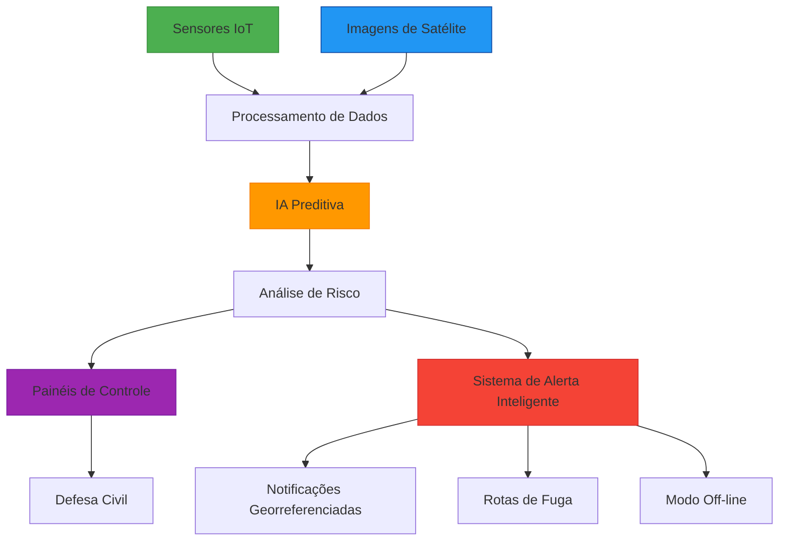
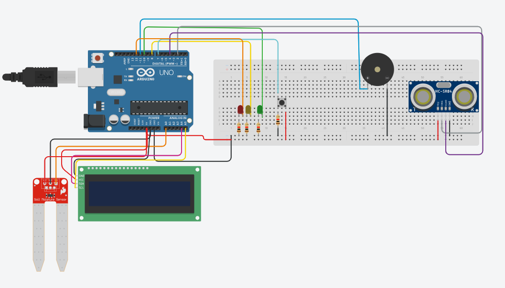

# 🌧️ Chuva Alerta - Sistema Inteligente de Prevenção a Enchentes

## 📌 Problema: O Desafio das Enchentes no Brasil

**Dados Alarmantes:**
- ⚠️ 110 milhões de brasileiros afetados por enchentes (1991-2022)
- 💸 Prejuízos anuais de R$ 5 bilhões
- 🚨 Tempo médio de alerta atual: 2-6 horas (insuficiente para evacuações)

**Principais Gargalos:**
1. Sistemas de monitoramento desatualizados
2. Falta de integração entre dados meteorológicos e sensores locais
3. Comunicação ineficaz em áreas remotas
4. Dificuldade na priorização de áreas de risco

## 🚀 Nossa Solução: Tecnologia para Salvar Vidas

### Visão Geral
Sistema IoT integrado que combina:
- **Monitoramento em tempo real** (sensores locais)
- **Previsão avançada** (IA + imagens de satélite)
- **Alertas inteligentes** (multicanal e georreferenciados)

### Arquitetura do Sistema

### 🔍 Como Funciona?

1. **Detecção Precisa**:
   - Rede de sensores coleta dados críticos
   - IA analisa padrões históricos e em tempo real

2. **Alertas Antecipados**:
   - Até 48h de antecedência para enchentes
   - 3 níveis de gravidade (atenção, alerta, emergência)

3. **Comunicação Eficiente**:
   - SMS e notificações push para moradores
   - Painéis para Defesa Civil
   - Funciona mesmo sem internet

## 🛠️ Hardware: Componentes e Funcionamento

### Diagrama do Circuito

### Lista de Componentes
| Qtd | Componente               | Função                          |
|-----|--------------------------|---------------------------------|
| 1   | Sensor HC-SR04           | Medir nível de água            |
| 1   | Higrômetro               | Monitorar umidade do solo      |
| 1   | Arduino Uno              | Microcontolador                |
| 3   | LEDs (Verm/Amare/Verde)  | Indicar status                 |
| 1   | Buzzer                   | Alerta sonoro                  |
| 1   | LCD 16x2 I2C             | Exibir informações             |
| 1   | Botão                    | Simulador de pluviômetro - cada pulso equivale a 2mm      |
   

### 📋 Fluxo de Operação
1. Sensores coletam dados a cada 5s
2. Arduino processa e classifica riscos
3. Sistema ativa alertas conforme necessidade
4. Dados são exibidos no LCD

## 💻 Código: Funcionalidades Principais

### Principais Funções:

- lerSensores(): Coleta dados de umidade, nível d'água e precipitação
- avaliarRiscos(): Usa limiares pré-definidos para classificar perigo
- ativarAlertas(): Controla LEDs e buzzer conforme a gravidade
- atualizarDisplay(): Mostra informações no LCD de forma otimizada

## 🔌 Simulação do Projeto

### Como testar no Tinkercad:
1. Acesse o [projeto no Tinkercad](https://www.tinkercad.com/things/5xo0xr1HNxI-globalsolution?sharecode=tCowqLBeVExokEyz3WGyMYYNyjTtXARzz4a2c3ot0c0)
2. Clique em "Copiar e Editar" para criar sua versão
3. Experimente ajustar:
   - Controles de umidade
   - Distância do sensor de água
   - Contador de pulsos de chuva

### Cenários recomendados para teste:
- Simule solo saturado (umidade >80%)
- Crie risco de inundação (nível água <30cm)
- Gere chuva intensa (>20mm)

## 🎥 Vídeo Demonstrativo

[YouTube](#)

## 📊 Especificações Técnicas

| Parâmetro        | Faixa Normal | Estado de Atenção | Nível de Alerta |
|------------------|--------------|-------------------|-----------------|
| Umidade do Solo  | <60%         | 60-80%            | >80%            |
| Nível de Água    | >50cm        | 30-50cm           | <30cm           |
| Precipitação     | <10mm        | 10-20mm           | >20mm           |

## 👷‍♂️👷‍♀️ Equipe

Ana Clara Rocha de Oliveira 
Matheus Von Koss Wildeisen 
Vinicius Mafra Paiva

